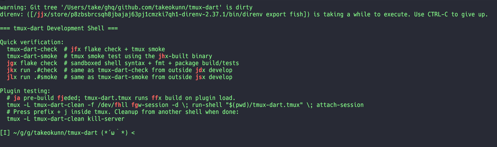

# tmux-dart

`tmux-dart` is an EasyMotion-like cursor jump plugin for tmux. It is implemented in Rust.

[](https://github.com/takeokunn/tmux-dart/actions/workflows/ci.yml)




## Features

- Uses `tmux-dart.tmux` as the tmux plugin entrypoint.
- Prompts for one leading character when the key binding is pressed.
- Searches the visible pane for positions matching the requested character.
- Shows the number of matches in the prompt before label selection starts.
- Supports overlay style presets for brighter, softer, and higher-contrast themes.
- Uses word-start matching by default.
- Uses `jfhgkdlsa` as the default label keys.
- Supports recursive multi-key label selection when there are many matches.
- Moves to the selected target with tmux copy-mode commands.

## Prerequisites

[Nix](https://nixos.org/download) with flakes enabled is required.

On normal plugin load, `tmux-dart.tmux` builds `result/bin/tmux-dart` with `nix build`. To use a pre-built binary, set `TMUX_DART_BINARY` to the executable path.

## Install

Clone the repository:

```sh
git clone https://github.com/takeokunn/tmux-dart ~/.tmux/plugins/tmux-dart
```

Then add this to `tmux.conf`:

```tmux
run-shell ~/.tmux/plugins/tmux-dart/tmux-dart.tmux
```

With TPM:

```tmux
set -g @plugin 'takeokunn/tmux-dart'
```

## Configuration

These tmux options are supported:

```tmux
set -g @jump-key 'j'
set -g @jump-bg-color '\e[0m\e[32m'
set -g @jump-fg-color '\e[1m\e[31m'
set -g @jump-theme 'classic'
set -g @jump-keys-position 'left'
set -g @jump-label-keys 'jfhgkdlsa'
set -g @jump-match-mode 'word'
set -g @jump-case-sensitive 'off'
set -g @jump-auto-jump 'on'
```

| Option | Default | Description |
| --- | --- | --- |
| `@jump-key` | `j` | Key bound in tmux to start tmux-dart. |
| `@jump-bg-color` | `\e[0m\e[32m` | Background-side style used while drawing labels. |
| `@jump-fg-color` | `\e[1m\e[31m` | Foreground-side style used while drawing labels. |
| `@jump-theme` | `classic` | Overlay theme preset. Accepts `classic`, `contrast`, or `soft`. Custom colors still override the preset. |
| `@jump-keys-position` | `left` | Accepts `left`, `right`, or `off_left`. `right` places labels after the target character width, which is useful for wide glyphs. |
| `@jump-label-keys` | `jfhgkdlsa` | Label keys. If fewer than two unique non-whitespace characters remain, tmux-dart falls back to the default. |
| `@jump-match-mode` | `word` | Accepts `word`, `char`, `anywhere`, `line`, or `line_start`. |
| `@jump-case-sensitive` | `off` | Enables case-sensitive matching for `on`, `true`, `yes`, or `1`. |
| `@jump-auto-jump` | `on` | Unless set to `off`, `false`, `no`, or `0`, jumps immediately when there is exactly one match. |

Theme presets control the default overlay colors and label treatment:

| Theme | Behavior |
| --- | --- |
| `classic` | Current default green background with red labels. |
| `contrast` | Higher-contrast white/black styling with emphasized labels. |
| `soft` | Lower-intensity cyan/yellow styling for a calmer overlay. |

`@jump-bg-color`, `@jump-fg-color`, and `@jump-keys-position` can still override the theme defaults.

`@jump-match-mode` behaves as follows:

| Value | Behavior |
| --- | --- |
| `word` | Matches word starts. Non-word targets (punctuation, symbols, whitespace) match every occurrence. Unknown values are treated as `word`. |
| `char` / `anywhere` | Matches every occurrence of the requested character. |
| `line` / `line_start` | Matches the first non-blank character on each matching line. |

## CLI

The binary provides a `jump` subcommand:

```sh
tmux-dart jump (--char <char> | --char-file <path>) [--pane-id <pane>]
```

- `--char <char>` sets the requested character.
- `--char-file <path>` reads a single character from a file. A trailing newline is ignored.
- `--char` and `--char-file` are mutually exclusive.
- `--pane-id <pane>` targets an explicit tmux pane. When omitted, tmux-dart uses the current pane.
- `--help` prints the CLI usage and exits.

## Development

Enter the development shell:

```bash
nix develop
```

Run checks:

```bash
nix flake check
```

`nix flake check` runs the Bash syntax check for `tmux-dart.tmux`, `cargo fmt --check`, `cargo clippy --all-targets -- -D warnings`, and the package build/tests.

Test the plugin interactively inside a clean tmux session:

```bash
tmux -L tmux-dart-clean -f /dev/null new-session -d \; run-shell "$(pwd)/tmux-dart.tmux" \; attach-session
# Press prefix + j inside tmux. Clean up from another shell when done:
tmux -L tmux-dart-clean kill-server
```

## License

MIT. See [LICENSE](LICENSE) for details.
